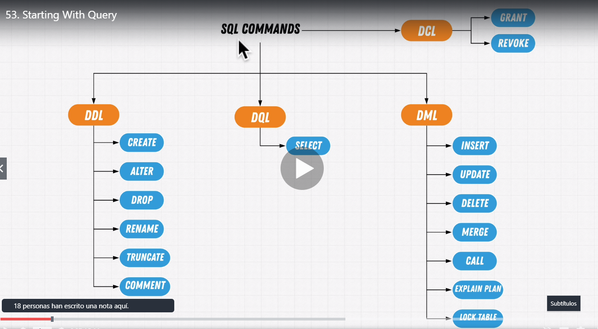
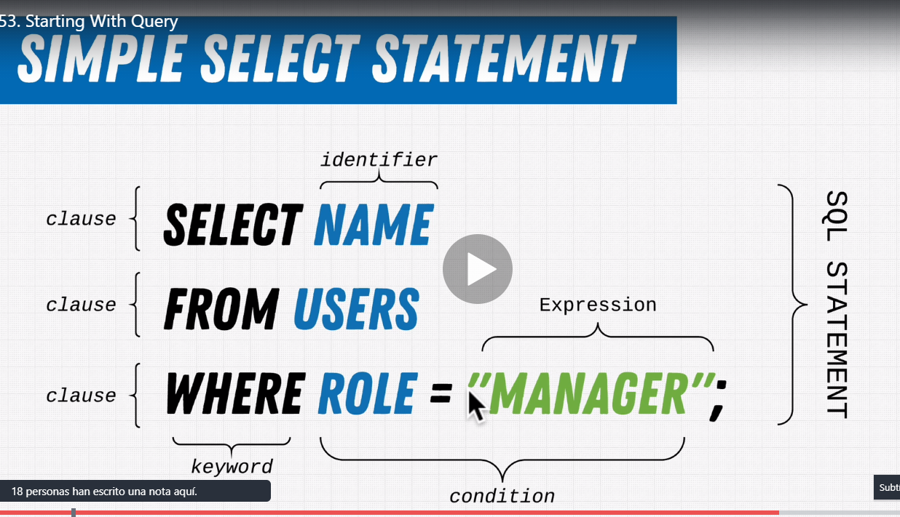
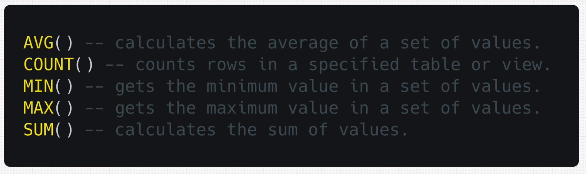

# SQL Knowledge

* Comenzaremos instalando PostgreSQL y ValentinaDB, que es un gestor de bases de datos.
* Aquí tenemos un pequeño esquema de los comandos de sql:    


## Comandos básicos
### Simple Select statement  


### Obtener todos los elementos de una tabla
* "public" es la base de datos, "titles" es el nombre de la tabla
* COMMAND: ```SELECT * FROM "public"."titles";```

### Concatenar valores de columnas (hay que asignarles un nuevo nombre)
* De la misma manera que aquí renombramos una concatenación, podemos renombrar cualquier columna
* COMMAND: ```SELECT emp_no, CONCAT(first_name, ' ', last_name) AS "full name" FROM employees;```

### Aggregate functions
* Son funciones que se pueden aplicar a las columnas, que aplican una operación agregada, ej: sumatorio


### Comentarios
* Los comentarios de una línea comienzan con: -- 
* Los comentarios multilínea son como siempre

### Un error importante en SQL es no recordar que las comillas simples se usan para definir texto, y las comillas dobles para definir tablas. Así, no será lo mismo la tabla "users", que "Users"

### Filtrando data: seleccionar todas las empleadas de la empresa
* COMMAND: ```SELECT first_name FROM employees WHERE gender = 'F';```

### Filtrando data: utilizar varios statements para filtrar (AND y OR)
* COMMAND: ```SELECT first_name FROM employees WHERE (state = 'OR' OR state = 'NY') AND gender = 'F';```
* Contar mujeres empleadas de Oregón o NY => COMMAND: ```SELECT COUNT(first_name) FROM employees WHERE (state = 'OR' OR state = 'NY') AND gender = 'F';```

### Filtrando data: NOT statement
* ¿Cuántos empleados tenemos que no tengan 55 años ni tampoco 20?
* COMMAND: ```SELECT COUNT(first_name) FROM employees WHERE NOT age = '55' AND NOT age = '20';```

### Los operadores de comparación son los mismos que para otros lenguajes
* Una curiosidad es saber que ('abc' > 'ace') devolvería true, porque si comparamos letra por letra y siguiendo el orden alfabético, la 'b' "va antes" que la 'c'.

### La preferencia de los operadores es más o menos como en todos los lenguajes de programación
* Si hay dudas de si estamos escribiendo realmente lo que queremos, lo mejor es poner paréntesis para controlar la preferencia mejor